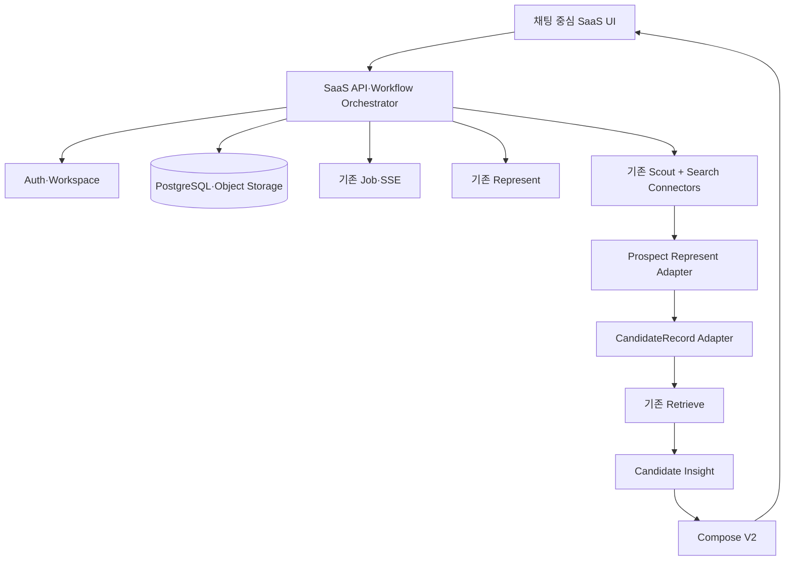

# K-EXAONE 기반 채팅형 Lead 발굴 SaaS 기획서

> 문서 상태: Draft v0.1  
> 작성일: 2026-08-06  
> 대상 범위: 기존 A2A 연구·데모 엔진을 실제 스타트업 고객용 Lead 발굴 SaaS로 전환  
> 핵심 원칙: 기존 `Represent`와 `Retrieve`는 최대한 유지하고 SaaS 상태 계층, 외부 후보 수집, Judge 없는 Compose V2, 채팅 중심 UI를 추가

## 1. 제품 개요

### 1.1 한 줄 정의

기업 자료와 대표 인터뷰를 통해 고객사를 이해하고, 발굴 목표에 맞는 잠재 고객을 웹에서 찾아 니즈를 추론한 뒤 맞춤형 아웃리치 이메일까지 작성하는 채팅형 Lead 발굴 SaaS.

### 1.2 해결하려는 문제

초기 스타트업은 해외 영업 전담 조직과 충분한 기업 데이터베이스를 보유하지 못한 경우가 많다. 대표 또는 소수의 사업개발 담당자가 다음 작업을 반복해서 수행해야 한다.

- 우리 기업과 제품을 해외 고객의 언어로 재정의
- 어떤 기업을 찾아야 하는지 검색 조건 설계
- 웹·디렉터리·뉴스에서 후보 기업 발굴
- 후보 기업의 현재 상황과 잠재 수요 조사
- 후보별로 다른 제안 논리와 이메일 작성
- 검색 근거와 작업 결과를 다시 정리하고 재사용

본 제품은 이 과정을 `기업 이해 → Lead Request 확정 → 후보 발굴 → 후보 리서치 → 이메일 초안`으로 구조화하고, 전체 흐름을 하나의 채팅 인터페이스에서 실행하도록 하는 것을 목표로 한다.

### 1.3 핵심 사용자

- 해외 영업을 처음 시작하는 스타트업 대표
- 별도 리서치팀 없이 파트너·고객을 발굴하는 사업개발 담당자
- 특정 국가 또는 산업에서 PoC·유통·판매 기회를 찾는 중소기업
- 다수 고객사의 Lead 발굴을 대행하는 액셀러레이터·컨설턴트

### 1.4 핵심 가치

1. 단순 키워드가 아니라 기업의 문제·솔루션·타깃·레퍼런스를 이해한 검색
2. 매 Request마다 발굴 목적과 제외 조건을 대화로 명확하게 확인
3. 기존 기업 DB에 한정되지 않고 웹과 외부 데이터 소스에서 후보를 동적으로 발굴
4. 후보 기업의 관측 가능한 수요 신호와 요청 기업의 솔루션을 연결한 개인화 이메일 작성
5. 후보 선정 이유, 사용한 출처, 추론과 확인 정보를 분리해 사용자 검토 가능

## 2. 제품 범위

### 2.1 MVP 포함 범위

- 회사 이메일 가입 및 이메일 인증
- 기업 Workspace 생성과 사용자 소유권 연결
- 기업 기본 정보·IR·회사소개서·웹사이트 업로드
- 기존 Represent 기반 기업 프로필 생성
- 채팅 기반 보강 질문과 답변 누적
- 기업 프로필 확인·수정·승인
- 복수 Lead Request 생성과 이력 관리
- 채팅 기반 Request 목표·검색 조건 확정
- 기존 Retrieve 기반 이상적 상대상 생성
- 웹 검색·크롤링·외부 API 기반 후보 수집
- 후보 기업 리서치 및 프로필 구조화
- 기존 Retrieve에 동적 후보를 주입한 재랭킹
- 후보별 잠재 니즈·자사 솔루션 연결점 생성
- Judge 없이 이메일 제목·본문을 생성하는 Compose V2
- 이메일 복사·편집·CSV 내보내기
- 비동기 작업 상태, 출처, 실행 로그 표시
- 자동 발송 없는 사람 승인 구조

### 2.2 MVP 제외 범위

- 기존 Judge 기반 적합·부적합 최종 판정
- 실제 후보 기업 Agent와의 실시간 협상
- 자동 이메일 발송과 다단계 캠페인
- CRM 양방향 동기화
- 결제·구독·사용량 과금
- 복잡한 조직 권한 체계
- 사용 결과를 이용한 온라인 모델 자동 학습
- LinkedIn 등 서비스 약관을 우회하는 자동 수집

### 2.3 Judge 처리 원칙

Judge 코드는 삭제하지 않는다. 연구·평가·향후 고도화 자산으로 유지하되 SaaS MVP 실행 경로와 UI에서는 호출하지 않는다.

```text
기존 데모: Represent → Retrieve → Judge → Compose
SaaS MVP:  Represent → Retrieve → Candidate Insight → Compose V2
```

## 3. 사용자 여정

```mermaid
flowchart LR
    A[회사 이메일 가입] --> B[Workspace 생성]
    B --> C[기업 정보·자료 업로드]
    C --> D[기존 Represent 실행]
    D -->|정보 부족| E[채팅 보강 질문]
    E --> D
    D -->|기준 충족| F[기업 프로필 확인]
    F --> G[Lead Request 생성]
    G --> H[채팅으로 목표·조건 확정]
    H --> I[기존 Retrieve 상대상 생성]
    I --> J[사용자 검색 조건 확인]
    J --> K[웹·외부 API 후보 수집]
    K --> L[후보 프로파일링]
    L --> M[기존 Retrieve 동적 재랭킹]
    M --> N[후보 목록·근거 확인]
    N --> O[Candidate Insight 생성]
    O --> P[Compose V2 이메일 생성]
    P --> Q[사용자 검토·수정·복사]
```



### 3.1 가입

1. 사용자가 회사 이메일 입력
2. 인증 링크 또는 OTP 확인
3. 이메일 도메인을 기준으로 신규 Workspace 생성 또는 기존 Workspace 가입 요청
4. 대표자 또는 최초 가입자를 Workspace Owner로 지정
5. 개인 이메일 사용 기업은 홈페이지·사업자 정보 등을 통한 보완 인증 허용

회사 이메일은 대표 권한을 완전히 증명하는 수단이 아니라 기본 신뢰 신호로 취급한다. 소유권 분쟁과 기존 Workspace 가입 요청을 처리할 별도 운영 정책이 필요하다.

### 3.2 기업 온보딩

사용자는 다음 자료를 입력할 수 있다.

- 기업명, 국가, 산업, 홈페이지
- IR 또는 회사소개서 PDF
- 제품소개서, 브로슈어, 포트폴리오
- 홈페이지·기사·보도자료 URL
- 제품·솔루션 직접 설명
- 기존 고객·레퍼런스
- 희망 시장과 제공할 수 없는 범위

자료 업로드 후 기존 Represent를 실행한다. 정보가 부족하면 채팅을 통해 질문하고, 답변을 기존 `DialogueTurn` 형식으로 누적해 Represent를 재실행한다.

### 3.3 기업 프로필 확정

다음 정보가 구조화된 기업 프로필로 표시되어야 한다.

- 기업 정체성
- 해결하는 문제
- 제공 솔루션
- 핵심 타깃 고객
- 구매자가 얻는 가치
- 사업모델과 계약 구조
- 주요 제품·기능
- 기존 고객과 레퍼런스
- 차별점
- 현재 사업 단계
- 보유 자원과 부족 자원
- 관측된 위험 신호
- 확인된 정보·추론된 정보·추가 확인 필요 정보

최종 프로필은 사용자가 확인하고 승인해야 한다. 이후 Lead Request는 승인된 프로필 버전을 참조한다.

### 3.4 Lead Request 생성

사용자가 채팅으로 발굴 목표를 입력한다.

예시:

> 일본의 객실 50~200개 독립 호텔 중 리모델링 또는 운영 개선 수요가 있을 가능성이 높은 호텔 30곳을 찾고 싶음.

시스템은 대화를 통해 다음 필드를 확정한다.

- 발굴 목적: 판매·PoC·파트너십·유통 등
- 목표 국가·지역
- 목표 산업과 기업 유형
- 기업 규모
- 희망 담당자 직무
- 제안할 제품·솔루션
- 가치 제안
- 가격 또는 계약 범위
- 필수 조건
- 제외 조건
- 희망 Lead 수
- 아웃리치 언어·톤
- 최종 행동 요청

확정 결과는 `Lead Request Brief`로 표시하고 사용자의 승인을 받는다.

### 3.5 후보 발굴과 이메일 작성

1. 기존 Retrieve가 이상적 상대상을 생성
2. 사용자가 상대상과 검색 조건을 검토
3. Scout와 외부 커넥터가 후보 기업 URL 수집
4. 후보 자료를 수집하고 후보 Profile 생성
5. 후보 Profile을 `CandidateRecord`로 변환
6. 기존 Retrieve가 동적 후보를 재랭킹
7. 상위 후보에 대해서만 연락처 보강 API 실행
8. 후보별 Candidate Insight 생성
9. Compose V2가 이메일 제목·본문 생성
10. 사용자가 검토·수정 후 복사 또는 내보내기

## 4. 목표 시스템 구조



### 4.1 설계 원칙

- 엔진은 가능한 한 Stateless로 유지
- 사용자·Workspace·기업·Request·대화·후보 상태는 SaaS 제품 계층이 보유
- Represent와 Retrieve의 기존 테스트 계약을 기본값에서 유지
- 웹 후보는 기존 `Profile`과 `CandidateRecord` 스키마로 변환해 Retrieve에 주입
- 장시간 실행은 기존 Job과 SSE를 사용
- 모델 결과와 출처·사용자 답변·확정 정보를 구분해 저장
- 이메일은 항상 초안으로 생성하고 자동 발송하지 않음

## 5. 기존 Represent 유지 및 확장 계획

### 5.1 그대로 유지할 항목

현재 [`app/engine/represent.py`](../app/engine/represent.py)와 관련 스키마에서 다음 기능을 유지한다.

| 항목 | 유지 내용 |
|---|---|
| 입력 스키마 | `Asset`, `DialogueTurn`, `RepresentRequest` 유지 |
| 자산 수집 | PDF·웹사이트·기사·텍스트·포트폴리오 입력 유지 |
| 기업 분석 | 문제·솔루션·타깃·가치 제안·기업의 상 생성 유지 |
| 근거 관리 | `stated`, `inferred`, `ask` provenance 구분 유지 |
| 신뢰도 | 추론 필드 confidence 계약 유지 |
| 그라운딩 | 원문 기반 stated 검증과 강등 로직 유지 |
| 보강 질문 | `open_questions`와 질문 공리 로직 유지 |
| 최소 기준 | 요청 기업에 대한 `ProfileBelowMinimum` 게이트 유지 |
| 온톨로지 | 산업·지역·단계 anchor 생성 유지 |
| 감사 기록 | Represent 입력·결과·실행 모드 로그 유지 |
| 제품 저장 | 기존 `Profile`을 기업 프로필의 핵심 데이터 타입으로 유지 |

### 5.2 제품 계층에 추가할 항목

Represent 엔진 앞에 `OnboardingSession`을 추가한다.

```text
OnboardingSession
- session_id
- workspace_id
- user_id
- company_id
- asset_ids
- dialogue
- current_questions
- status
- represent_job_id
- created_at
- updated_at
```

현재 최초 Represent가 최소 기준을 통과하지 못하면 기업 레코드가 생성되지 않는다. SaaS에서는 자료 업로드 즉시 Session을 생성하고, Represent 성공 전까지 자료와 대화를 Session에 보존해야 한다.

```text
collecting
→ representing
→ clarifying
→ representing
→ review_required
→ completed
```

### 5.3 요청 기업 실행 방식

```python
result = represent(
    RepresentRequest(
        assets=session.assets,
        dialogue=session.dialogue,
        lens_hint="sell",
    )
)
```

`profile_below_minimum` 발생 시 오류로 종료시키지 않고 SaaS Orchestrator가 다음을 수행한다.

1. `details.open_questions`와 `details.clarify` 저장
2. 질문을 채팅 메시지로 표시
3. 사용자 답변을 `DialogueTurn(q, a)`로 저장
4. 같은 자산과 누적 대화로 Represent 재실행
5. 성공 시 CompanyProfile 버전 생성

### 5.4 후보 기업 Represent 모드

웹에서 발견한 후보 기업에는 직접 질문할 사용자가 없으므로 요청 기업과 동일한 최소 기준을 강제할 수 없다. 기존 동작을 깨지 않도록 기본값을 유지하면서 선택 필드를 추가한다.

```python
class RepresentRequest(BaseModel):
    ...
    profile_purpose: Literal["requester", "prospect"] = "requester"
```

- `requester`: 현재 최소 프로필 게이트와 보강 대화를 그대로 적용
- `prospect`: 자료가 부족해도 부분 Profile과 `minimum_met=False`를 반환

후보 모드에서도 다음 규칙은 유지한다.

- 원문 근거가 없는 사실을 confirmed로 표시하지 않음
- 추론 정보에는 confidence 필수
- 미확인 정보는 비워두거나 `ask`로 표시
- 후보 기업의 의도·불법성·평판을 확정적으로 단정하지 않음

### 5.5 추가 최적화

보강 답변마다 PDF와 웹페이지를 다시 파싱하지 않도록 자산 추출 결과와 청크를 캐시한다.

```text
CompanyAsset → ParsedAsset → SourceChunk
```

Represent 재실행 시 원본 다운로드·OCR·청킹을 반복하지 않고 저장된 SourceChunk와 새로운 DialogueTurn만 사용하도록 확장한다.

## 6. 기존 Retrieve 유지 및 확장 계획

### 6.1 그대로 유지할 항목

현재 [`app/engine/retrieve.py`](../app/engine/retrieve.py)에서 다음 기능을 유지한다.

| 항목 | 유지 내용 |
|---|---|
| 요청 스키마 | `RetrieveRequest`와 기존 `Intent` 기반 호출 유지 |
| 검색 방향 | `sell_outreach` 방향 유지 |
| 상대상 | 결정적 anchor와 LLM synthesized counterpart 생성 유지 |
| 입력 게이트 | 요청 기업 핵심 필드 검증 유지 |
| 보완성 검색 | 문제·솔루션·타깃과 후보 정보의 보완성 점수 유지 |
| 경쟁 후보 처리 | 동종·경쟁 가능성에 대한 기존 점수 조정 유지 |
| 재현성 | `company_id` 기반 결정적 정렬 유지 |
| 재랭킹 | EXAONE 1.2B 스코어러 연결 유지 |
| API 비교 | 연구·운영 점검용 비교 기능은 내부 옵션으로 유지 |
| 약한 후보 | `allow_weak`와 후보별 `weak` 표시 계약 유지 |
| 동적 후보 | `candidate_records` 인자 주입 방식 유지 |
| 결과 설명 | `synthesized_counterpart`, `match_points` 유지 |

### 6.2 핵심 변경: 검색과 순위화 분리

현재 제품 경로는 고정 풀을 먼저 Retrieve로 검색하고 후보가 없을 때 Scout를 호출한다. SaaS에서는 순서를 다음처럼 변경한다.

```text
현재: 고정 후보 풀 → Retrieve → 부족할 때 Scout
변경: 상대상 생성 → Scout·외부 API → 동적 후보 풀 → Retrieve 재랭킹
```

Retrieve 내부 알고리즘은 바꾸지 않고 SaaS Orchestrator가 `candidate_records`를 전달한다.

```python
ranked = retrieve(
    RetrieveRequest(
        requester_profile=company_profile,
        intent=lead_request.intent,
        direction=RetrieveDirection.sell_outreach,
        pool=PoolChoice.external,
        k=lead_request.lead_count,
        allow_weak=True,
    ),
    candidate_records=dynamic_candidates,
)
```

### 6.3 상대상 생성 기능 공개

현재 Retrieve 내부의 `template_counterpart()`와 `synthesize_counterpart()`를 검색 전 단계에서 사용할 수 있도록 공개 래퍼를 추가한다.

```python
class SearchBrief(BaseModel):
    deterministic_anchor: str
    synthesized_counterpart: str
    query_hypotheses: list[str]
    must_have: list[str]
    exclusions: list[str]

def build_search_brief(req: RetrieveRequest) -> SearchBrief:
    ...
```

SearchBrief는 다음 용도로 사용한다.

- 사용자에게 검색할 기업상 확인
- 웹 검색 쿼리 생성
- 외부 기업 API 필터 생성
- 검색 결과가 목표에서 벗어났을 때 Request 수정
- 실행 이력과 재검색 조건 기록

### 6.4 동적 후보 생성

기존 Scout와 신규 외부 커넥터가 발견한 기업을 후보 Profile로 만든 뒤 `CandidateRecord`로 변환한다.

```python
def candidate_record_from_profile(
    candidate_id: str,
    profile: Profile,
    source_url: str,
) -> CandidateRecord:
    ...
```

후보 입력 소스:

- 일반 웹 검색
- 기업 홈페이지
- 산업별 디렉터리
- 협회·전시회 참가 기업 목록
- 뉴스·보도자료
- 채용공고
- 상용 기업 데이터 API

연락처·이메일 탐색 API는 후보 발굴 단계가 아니라 Retrieve 상위 후보가 정해진 이후에 호출한다. 이를 통해 비용과 불필요한 개인정보 수집을 줄인다.

### 6.5 Lead Request용 Intent 확장

기존 `Intent` 필드는 유지하고 SaaS용 선택 필드를 추가한다.

```text
기존 유지
- value_props
- target_region
- target_type
- proposal_type
- price_range
- notes
- differentiator
- key_proof
- entry_channel

추가
- target_industry
- target_company_size
- target_contact_role
- must_have_conditions
- excluded_conditions
- lead_count
- outreach_language
- call_to_action
```

기존 테스트와 API 호환성을 위해 신규 필드는 모두 optional 또는 기본값을 갖도록 한다.

## 7. Candidate Insight 설계

Judge를 제거하면 Retrieve 결과와 Compose 사이에 이메일 작성에 필요한 최소 해석 계층이 필요하다. 이 계층은 후보의 적합·부적합을 결정하지 않는다.

```python
class CandidateInsight(BaseModel):
    candidate_id: str
    observed_needs: list[str]
    need_evidence: list[EvidenceRef]
    value_bridge: list[str]
    personalization_hooks: list[str]
    uncertainties: list[str]
    source_urls: list[str]
```

### 7.1 필드 의미

- `observed_needs`: 공개 정보에서 관측되거나 제한적으로 추론된 잠재 수요
- `need_evidence`: 잠재 수요를 뒷받침하는 홈페이지·뉴스·채용·공시 근거
- `value_bridge`: 후보의 문제와 요청 기업 솔루션의 연결점
- `personalization_hooks`: 이메일 첫 문장에 사용할 수 있는 구체적 사실
- `uncertainties`: 사실로 확인되지 않았으며 이메일에서 단정하면 안 되는 내용
- `source_urls`: 사용자가 직접 확인할 수 있는 원문

### 7.2 생성 원칙

- 후보의 잠재 니즈를 실제 의도나 확정 사실처럼 표현하지 않음
- 관측 사실과 AI 추론을 구분
- 근거 없는 수치·고객명·성과를 생성하지 않음
- 요청 기업이 실제로 제공할 수 있는 솔루션만 연결
- 후보 선정 이유와 이메일 개인화 근거를 분리

## 8. Compose V2 설계

### 8.1 현재 Compose의 문제

현재 [`app/engine/compose.py`](../app/engine/compose.py)는 `ComposeRequest.judge_result`를 필수 입력으로 사용한다. SaaS MVP에서 Judge를 제외하면 기존 Compose를 그대로 호출할 수 없다.

가짜 JudgeResult를 생성해 기존 Compose에 전달하지 않는다. 이는 실제로 수행하지 않은 판정과 근거가 로그·UI에 남는 문제를 발생시킨다.

### 8.2 유지할 항목

| 항목 | 유지 내용 |
|---|---|
| LLM 인프라 | 기존 K-EXAONE extractor와 구조화 호출 유지 |
| 생성 모드 | 아웃리치 메시지 생성 개념 유지 |
| 변형 | 제목·본문 A/B 버전 생성 유지 |
| 출력 정화 | 공개 본문 정리와 스키마 검증 유지 |
| 근거 추적 | claim과 evidence reference 연결 유지 |
| 발송 통제 | `send_blocked=True` 유지 |
| 실행 로그 | 진행 로그·소요시간·실행 모드 기록 유지 |

### 8.3 신규 입력 스키마

```python
class ComposeLeadRequest(BaseModel):
    requester_profile: Profile
    lead_request: LeadRequestBrief
    candidate_profile: Profile
    candidate_insight: CandidateInsight
    contact: Contact | None = None
    variants: int = 2
    tone: str | None = None
    language: str = "ko"
```

### 8.4 신규 출력 스키마

```python
class LeadEmailDraft(BaseModel):
    variant_label: str
    subject: str
    body: str
    call_to_action: str
    claim_trace: list[ClaimTrace]
    sources_used: list[str]
    warnings: list[str]

class ComposeLeadResponse(BaseModel):
    drafts: list[LeadEmailDraft]
    send_blocked: bool = True
```

### 8.5 Compose 입력 논리

```text
후보의 관측 가능한 잠재 니즈
+ 후보가 사용하는 가치 언어
+ 요청 기업이 제공할 수 있는 솔루션
+ 요청 기업의 확인된 레퍼런스
+ Lead Request의 목표와 CTA
= 후보별 이메일 제목·본문
```

### 8.6 생성 결과

- 이메일 제목 2~3개
- 이메일 본문 2개 이상
- 후보별 개인화 첫 문장
- 요청 기업의 솔루션과 후보 니즈 연결 문장
- 과도하지 않은 CTA
- 사용 근거와 출처
- 확인되지 않아 본문에서 제외한 정보
- 발송 전 사용자 확인 경고

### 8.7 자동 발송 제한

MVP에서는 이메일 전송 기능을 구현하지 않는다.

- 사용자가 본문 확인
- 직접 수정 가능
- 클립보드 복사
- CSV 내보내기
- 향후 이메일 발송 연동 시 별도 승인 단계 추가

## 9. 채팅 중심 UI 기획

### 9.1 UI 원칙

채팅을 메인 실행 인터페이스로 사용하되, 확정된 기업 정보·Request·후보·메일을 채팅 기록에만 두지 않는다. 채팅은 명령과 대화의 흐름을 담당하고, 구조화된 결과는 고정 패널에 누적한다.

```text
┌────────────────┬────────────────────────────┬──────────────────────┐
│ Workspace      │ 메인 채팅                   │ 현재 Request 결과     │
│                │                            │                      │
│ + 새 Request   │ 자료 업로드                 │ 기업 프로필           │
│ 진행 중        │ Represent 보강 질문         │ Request Brief         │
│ 완료           │ 검색 목표 확인              │ 후보 목록             │
│ 저장한 Lead    │ Retrieve 진행               │ Candidate Insight     │
│ 설정           │ 이메일 작성·수정 요청       │ 이메일 초안           │
└────────────────┴────────────────────────────┴──────────────────────┘
```

### 9.2 왼쪽 영역

- Workspace·기업 선택
- 새 Lead Request 버튼
- 진행 중 Request
- 완료된 Request
- 저장한 후보
- 내보내기 기록
- 사용자·기업 설정

### 9.3 중앙 채팅 영역

지원해야 할 메시지 타입:

```text
TextMessage
FileUploadMessage
ClarificationQuestion
ChoiceQuestion
ProfileSummaryCard
ProfileDiffCard
RequestBriefCard
SearchBriefCard
ProgressMessage
CandidateCard
EmailDraftCard
ErrorRecoveryMessage
```

채팅 예시:

1. “IR 자료를 올려주세요.”
2. 파일 업로드와 Represent 진행 표시
3. “자료에서 우선 고객군을 확정할 수 없습니다.”
4. 선택지 또는 직접 답변
5. 기업 프로필 요약과 승인 버튼
6. “이번에는 어떤 Lead를 찾고 싶나요?”
7. Request Brief 생성과 수정
8. 이상적 상대상 표시와 검색 승인
9. 후보 검색 진행과 결과 카드
10. 후보 선택 후 이메일 초안 생성

### 9.4 오른쪽 영역

탭 구성:

1. `기업 프로필`
2. `Request Brief`
3. `검색 조건`
4. `후보`
5. `이메일 초안`

후보 탭은 테이블 또는 카드 보기 전환을 지원한다.

후보 표시 정보:

- 기업명·국가·산업
- 홈페이지
- 후보 선정 이유
- 관측된 수요 신호
- 요청 기업 솔루션과의 연결점
- 출처
- 정보 확인 수준
- 예상 담당자
- 이메일 확인 상태
- 저장·제외·초안 생성 버튼

### 9.5 기존 UI 재사용

현재 [`app/product/static/index.html`](../app/product/static/index.html)과 [`app/product/static/app.js`](../app/product/static/app.js)의 다음 기능을 재사용한다.

| 기존 기능 | 처리 방향 |
|---|---|
| 메인 채팅 컴포저 | 유지·확대 |
| PDF 첨부 | 유지 |
| 기업 자료 입력 | 가입 후 온보딩 단계로 이동 |
| Represent 진행 로그 | 유지 |
| 보강 질문·선택지 | 유지 |
| 프로필 카드 | 오른쪽 기업 프로필 탭으로 이동 |
| 후보 카드 | 오른쪽 후보 탭과 채팅에 동시 표시 |
| Compose 메일 카드 | Compose V2 응답으로 교체 |
| 복사 버튼 | 유지 |
| SSE 실시간 표시 | 유지 |
| DAG 캔버스 | 기본 사용자 화면에서 제거 |
| Judge 버튼·노드·대화 | SaaS 경로에서 제거 |
| A2A 상세 화면 | 관리자·연구용 화면으로 분리 |
| DB 인스펙터 | 개발자 전용으로 제한 |

### 9.6 주요 화면

```text
/login
/verify-email
/onboarding
/app/requests
/app/requests/new
/app/requests/{request_id}
/app/leads
/app/settings/company
/app/settings/team
```

## 10. 데이터 모델

```text
User
- id
- email
- email_verified_at
- name
- created_at

Workspace
- id
- name
- company_domain
- owner_user_id
- created_at

Membership
- workspace_id
- user_id
- role

Company
- id
- workspace_id
- name
- website
- current_profile_version_id

CompanyAsset
- id
- company_id
- type
- storage_key
- source_url
- checksum
- created_at

CompanyProfileVersion
- id
- company_id
- profile_json
- evidence_json
- status
- approved_by
- approved_at

OnboardingSession
- id
- company_id
- dialogue_json
- current_questions_json
- status
- job_id

LeadRequest
- id
- company_id
- created_by
- title
- intent_json
- brief_json
- status
- profile_version_id
- created_at

ChatMessage
- id
- request_id 또는 onboarding_session_id
- role
- type
- content_json
- created_at

SearchRun
- id
- request_id
- search_brief_json
- status
- job_id
- created_at

Candidate
- id
- request_id
- company_name
- website
- profile_json
- source_urls_json
- retrieve_result_json
- status

CandidateInsight
- id
- candidate_id
- insight_json
- created_at

Contact
- id
- candidate_id
- name
- role
- email
- verification_status
- source

EmailDraft
- id
- candidate_id
- subject
- body
- claim_trace_json
- version
- edited_by_user
- created_at

AuditLog
- id
- workspace_id
- actor
- action
- object_type
- object_id
- metadata_json
- created_at
```

### 10.1 저장소 전략

- 개발·로컬 데모: 기존 SQLite 유지 가능
- SaaS 운영: PostgreSQL 권장
- PDF·이미지·원문: Object Storage
- 파일 접근: 만료형 Signed URL
- Profile·Insight·로그의 중첩 구조: JSONB 활용
- 사용자와 Workspace가 모든 데이터 조회 조건의 첫 번째 경계가 되도록 설계

## 11. API 초안

### 11.1 인증·Workspace

```text
POST /auth/signup
POST /auth/verify-email
POST /auth/login
POST /workspaces
GET  /workspaces/current
POST /workspaces/{id}/invite
```

### 11.2 기업 온보딩

```text
POST /companies
POST /companies/{id}/assets
POST /companies/{id}/onboarding-sessions
POST /onboarding-sessions/{id}/messages
POST /onboarding-sessions/{id}/run-represent
GET  /onboarding-sessions/{id}
POST /companies/{id}/profiles/{version_id}/approve
```

### 11.3 Lead Request

```text
POST /lead-requests
GET  /lead-requests
GET  /lead-requests/{id}
POST /lead-requests/{id}/messages
POST /lead-requests/{id}/confirm-brief
POST /lead-requests/{id}/build-search-brief
POST /lead-requests/{id}/confirm-search-brief
POST /lead-requests/{id}/search
GET  /lead-requests/{id}/candidates
```

### 11.4 후보·Compose

```text
GET  /candidates/{id}
POST /candidates/{id}/save
POST /candidates/{id}/exclude
POST /candidates/{id}/enrich-contact
POST /candidates/{id}/build-insight
POST /candidates/{id}/compose
PATCH /email-drafts/{id}
POST /lead-requests/{id}/export
```

### 11.5 비동기 작업

기존 Job·SSE 계약을 유지한다.

```text
GET /product/jobs/{job_id}
GET /product/jobs/{job_id}/events
```

필요 시 외부 API에 노출되는 경로만 `/v1/jobs`로 정리하고 기존 경로에는 호환 라우트를 유지한다.

## 12. 상태 모델

### 12.1 기업 온보딩

```text
collecting
→ representing
→ clarifying
→ review_required
→ completed
```

### 12.2 Lead Request

```text
draft
→ brief_review
→ target_review
→ discovering
→ enriching
→ ranking
→ candidates_ready
→ composing
→ completed
```

오류 시 모든 단계를 처음부터 다시 실행하지 않도록 실패 단계와 입력 스냅샷을 저장한다.

## 13. 코드 변경 구조

### 13.1 유지 중심 파일

```text
app/engine/represent.py
app/engine/retrieve.py
app/engine/scout.py
app/engine/llm.py
app/jobs.py
app/progress.py
app/schemas.py의 Profile·Asset·DialogueTurn·Intent 계열
```

### 13.2 최소 수정 파일

```text
app/engine/represent.py
- requester/prospect 목적 구분
- prospect 모드에서 부분 Profile 반환
- 자산 파싱 캐시 연동 지점 추가

app/engine/retrieve.py
- build_search_brief 공개 래퍼
- 동적 후보 경로에 대한 메타데이터 강화

app/schemas.py
- LeadRequestBrief
- SearchBrief
- CandidateInsight
- ComposeLeadRequest/Response
- 기존 Intent의 optional 필드 확장

app/product/router.py
- 기존 데모 라우트 유지
- 신규 SaaS 라우터로 점진 이전

app/product/static/*
- Judge 흐름 제거
- SaaS 레이아웃으로 개편
```

### 13.3 신규 모듈

```text
app/auth/
  router.py
  service.py
  models.py

app/lead_requests/
  router.py
  service.py
  store.py
  orchestrator.py

app/connectors/
  base.py
  web_search.py
  company_search.py
  contact_enrichment.py

app/engine/
  candidate_adapter.py
  candidate_insight.py
  compose_lead.py
```

## 14. 단계별 구현 계획

### Phase 0. 기존 엔진 보호

- Represent·Retrieve 현재 테스트 통과 기준 고정
- 기존 데모 API 회귀 테스트 확보
- Judge를 호출하지 않는 신규 실행 경로 테스트 추가
- 현재 Profile·Intent·CandidateRecord 스키마 호환성 기록

완료 조건:

- 기존 테스트 결과가 신규 SaaS 작업으로 악화되지 않음
- 신규 필드의 기본값으로 기존 요청이 그대로 동작함

### Phase 1. Auth·Workspace·LeadRequest 기반

- 사용자·Workspace·Membership 모델
- 이메일 인증
- 기업 소유권 연결
- LeadRequest·ChatMessage 저장
- 기존 SQLite 개발 환경 지원

완료 조건:

- 가입 사용자가 자신의 Workspace 데이터만 조회 가능
- 하나의 기업에서 여러 Lead Request 생성 가능

### Phase 2. Represent 채팅 온보딩

- OnboardingSession 추가
- 자료 업로드와 자산 저장
- Represent 실행·실패 질문 저장
- DialogueTurn 누적과 재실행
- 기업 프로필 승인·버전 관리
- 프로필 오른쪽 패널 구현

완료 조건:

- 첫 분석이 최소 기준에 미달해도 세션이 유실되지 않음
- 사용자 답변 후 동일 프로필이 개선됨
- 승인된 프로필이 Lead Request에 재사용됨

### Phase 3. Request·Retrieve 동적 후보 발굴

- 채팅에서 Intent 구조화
- Request Brief 확인
- build_search_brief 구현
- 기존 Scout와 외부 검색 커넥터 연결
- 후보 prospect Represent
- CandidateRecord Adapter
- 기존 Retrieve에 동적 후보 주입

완료 조건:

- 고정 데모 풀 없이 웹 후보를 Retrieve가 순위화함
- 모든 후보에 원문 URL과 선정 이유가 표시됨
- 같은 SearchRun 결과를 재조회할 수 있음

### Phase 4. Candidate Insight·Compose V2

- 후보 리서치 스냅샷
- 잠재 니즈와 근거 분리
- Value Bridge 생성
- ComposeLeadRequest·Response
- 제목·본문 A/B 버전
- 초안 편집·복사·저장

완료 조건:

- JudgeResult 없이 이메일 생성 가능
- 이메일 주요 주장에 근거 출처가 연결됨
- 자동 발송 경로가 존재하지 않음

### Phase 5. SaaS UI 통합

- 로그인·온보딩 화면
- Request 목록
- 중앙 채팅
- 오른쪽 구조화 패널
- 후보 테이블·카드
- 이메일 편집기
- Job·SSE 진행 표시
- 오류 복구와 재시도

완료 조건:

- 가입부터 첫 이메일 초안까지 한 화면 흐름으로 완료 가능
- 브라우저 새로고침 후에도 Request와 대화가 유지됨

### Phase 6. 운영 고도화

- PostgreSQL 전환
- Object Storage
- 사용량 제한·비용 계측
- 데이터 삭제·보유기간 정책
- 관리자 운영 화면
- 감사 로그
- CRM·메일 연동 검토

## 15. 품질 및 안전 요구사항

### 15.1 데이터 보호

- 업로드 자료를 모델 학습에 사용하지 않는 것을 기본 정책으로 설정
- Workspace 간 데이터 격리
- 파일 저장 암호화와 접근 권한 통제
- 사용자의 기업·Request·후보 데이터 삭제 기능
- 로그에 API 토큰과 개인정보 기록 금지
- 자료 보유기간과 삭제 정책 고지

### 15.2 웹 수집

- robots.txt와 서비스 약관 준수
- 차단 우회·로그인 우회 수집 금지
- 출처 URL과 수집 시각 저장
- 동일 페이지 캐시와 호출 제한
- 원문 삭제 또는 변경 시 상태 표시

### 15.3 후보·이메일 생성

- 후보의 의도를 사실처럼 단정하지 않음
- 공개 근거가 없는 개인정보 생성 금지
- 이메일 주소는 출처와 검증 상태 표시
- 이메일의 모든 구체적 주장에 근거 연결
- 대량 자동 발송 금지
- 최종 발송과 관계 결정은 사용자 담당

## 16. 핵심 지표

### 16.1 활성화

- 가입 후 기업 프로필 승인 완료율
- 자료 업로드부터 프로필 승인까지 걸린 시간
- 보강 질문 응답 완료율
- 프로필에서 사용자가 직접 수정한 필드 비율

### 16.2 Lead 발굴

- Request 생성 완료율
- 검색 시작부터 첫 후보 표시까지 걸린 시간
- 검색된 후보 중 사용자가 저장한 비율
- 제외 후보의 사유 분포
- 후보 원문 확인 클릭률

### 16.3 Compose

- 후보 중 이메일 초안을 생성한 비율
- 생성 초안 채택률
- 사용자 편집 전후 변경량
- 복사·내보내기 비율
- 향후 연동 시 긍정 답장률·미팅 전환율

### 16.4 North Star 후보

> Lead Request당 사용자가 실제 아웃리치 대상으로 승인한 후보 수

초기에는 실제 계약 성사율보다 사용자가 후보를 저장하고 이메일 초안을 채택하는 행동을 우선 측정한다.

## 17. 주요 위험과 대응

| 위험 | 대응 |
|---|---|
| Represent가 사용자를 과도하게 질문 | 필수 필드와 선택 필드 분리, 질문 수 예산 유지 |
| 답변마다 자료 파싱 반복 | ParsedAsset·SourceChunk 캐시 |
| 웹 후보 정보 부족 | prospect 부분 Profile 허용, 불확실성 표시 |
| 검색 결과가 키워드 유사도로 회귀 | 기존 상대상·보완성 Retrieve와 재랭커 유지 |
| 외부 API 비용 증가 | 후보 수집→Retrieve→상위 후보 연락처 보강 순서 적용 |
| 후보의 잠재 니즈 과도한 추론 | 관측 사실·추론·미확인 상태 분리 |
| Judge 없이 Compose 근거 부족 | Candidate Insight와 Value Bridge를 명시적 입력으로 사용 |
| 채팅만으로 상태 파악 어려움 | 오른쪽 구조화 패널과 승인 카드 제공 |
| 동일 기업이 여러 Workspace 생성 | 도메인 확인과 소유권 병합 정책 |
| 이메일 자동화의 스팸 위험 | MVP 자동 발송 제외, 사람 승인 유지 |

## 18. 미결정 사항

다음 항목은 구현 전 제품 의사결정이 필요하다.

1. MVP의 Lead를 잠재 고객으로 한정할지 파트너·유통사까지 포함할지
2. 첫 지원 국가와 언어
3. 한 Request당 기본 후보 수와 외부 API 비용 한도
4. 개인 이메일 가입을 허용하는 조건
5. 후보 연락처 보강 시 사용할 데이터 공급자
6. 사용자가 수정한 기업 프로필을 Represent 재실행에서 어떻게 보호할지
7. 후보 Profile의 보유기간과 재사용 범위
8. 이메일 내보내기 형식과 CRM 연동 우선순위
9. 기존 데모 UI와 SaaS UI를 같은 앱에서 유지할지 별도 경로로 분리할지

## 19. 최종 구현 원칙 요약

1. 요청 기업과 후보 기업을 기존 `Profile`로 표현
2. 요청 기업은 기존 Represent와 보강 대화를 그대로 사용
3. 후보 기업은 Represent의 prospect 모드로 부분 Profile 허용
4. Lead Request를 기존 Intent의 확장으로 저장
5. 기존 Retrieve가 만든 상대상을 웹 검색의 기준으로 사용
6. 웹에서 수집한 후보를 `CandidateRecord`로 변환해 기존 Retrieve에 주입
7. Judge는 삭제하지 않고 SaaS 실행 경로에서만 제외
8. Candidate Insight가 Retrieve와 Compose V2 사이의 근거 계층을 담당
9. Compose V2는 JudgeResult가 아니라 후보 니즈·근거·Value Bridge를 입력으로 사용
10. 채팅을 메인 UI로 사용하되 확정된 상태는 오른쪽 패널에 구조화
11. 자동 발송 없이 사람이 모든 이메일을 검토·수정
12. 기존 Job·SSE·감사 로그와 엔진 테스트를 최대한 유지

---

본 기획의 핵심은 새 Lead 발굴 엔진을 다시 만드는 것이 아니다. 기존 Represent가 요청 기업과 후보 기업을 같은 Profile 구조로 이해하고, 기존 Retrieve가 Lead Request에 맞는 상대상을 생성해 외부 후보를 재랭킹하도록 제품 계층을 재구성하는 것이다. 신규 개발은 인증·Workspace·LeadRequest·웹 커넥터·Candidate Insight·Compose V2·SaaS UI에 집중한다.
